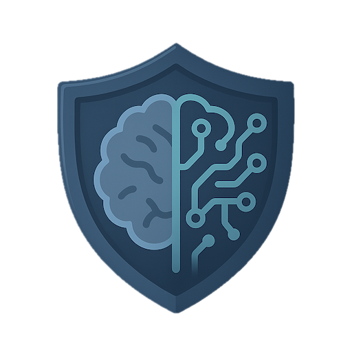

# CISO OS *

# System-Architektur 

## Einleitung: Das Framework

Wie ein modernes Betriebssystem aus klar definierten Schichten besteht – vom Kernel über die Middleware bis zur User Interface – gliedert sich auch die CISO-Arbeit in strukturierte Module. Diese Komponenten-Matrix bildet die Architektur des CISO OS ab: Jede Ebene erfüllt spezifische Funktionen, greift auf darunterliegende Services zu und stellt APIs für höhere Schichten bereit.

Die folgende Struktur organisiert CISO-Tätigkeiten nach ihrer systemischen Funktion – vom grundlegenden System Core über operative Security-Prozesse bis hin zu strategischen Governance-Funktionen. Wie bei einem gut designten OS sorgt die Modularität dafür, dass einzelne Komponenten austauschbar bleiben, während die Gesamtarchitektur stabil und wartbar ist.

> **Navigationshinweis**  
> Diese Liste dient als zentrale Referenz für alle CISO OS Ressourcen. Jede Funktionsbeschreibung verlinkt auf Informationen, Websteiten, relevante Werkzeuge, Templates und Dokumente im Repository.

---

- [System Core & Access](#system-core--access)
- [Security Operations & Intelligence](#security-operations--intelligence)
- [Cyber Resilience & Defense](#cyber-resilience--defense)
- [Strategic Governance & Leadership](#strategic-governance--leadership)
- [Technology Architecture & Innovation](#technology-architecture--innovation)
- [Workforce, Culture & Organization](#workforce-culture--organization)
- [External Ecosystem & Specialized Systems](#external-ecosystem--specialized-systems)
- [Updates & Community-Contributions](#updates--community-contributions)

- [Anmerkung zur OS-Metapher](#anmerkung-zur-os-metapher)

## System Core & Access
[back to top](#ciso-os-)

### Kernel, Boot & System Security

Die fundamentale Sicherheitsschicht – vergleichbar mit dem Betriebssystem-Kernel, der direkte Hardware-Kontrolle ausübt und grundlegende Sicherheitsmechanismen bereitstellt.

---

### Process, Memory & Storage Management

Überwachung und Absicherung von Prozessen, Speicher und Datenträgern – die Ressourcenverwaltung des CISO OS.

---

### Identity & Access Management

Das Berechtigungssystem des CISO OS – steuert, wer welche Ressourcen unter welchen Bedingungen nutzen darf.

---

## Security Operations & Intelligence
[back to top](#ciso-os-)

### Security Operations Center (SOC)

Die zentrale Steuerungseinheit für Security-Operations – vergleichbar mit einem Process Scheduler, der kontinuierlich Sicherheitsereignisse verarbeitet und priorisiert.

---

### Threat Detection & Exposure Management

Das Monitoring-Subsystem – überwacht kontinuierlich alle System-Events und identifiziert potenzielle Bedrohungen.

---

### Threat Intelligence & Analytics

Die Wissensdatenbank und Analyse-Engine – sammelt, korreliert und interpretiert Security-relevante Informationen.

---

### Security Automation & Orchestration

Das Automatisierungs-Framework – reduziert manuelle Prozesse durch intelligente Workflow-Orchestrierung.

---

### Vulnerability Management

Das System-Update und Patch-Management-Subsystem – identifiziert Schwachstellen und verwaltet deren Behebung.

---

### Incident Response & Crisis Management

Der Exception Handler des CISO OS – greift bei kritischen Sicherheitsvorfällen und verhindert System-Crashes.

---

### Security Testing & Validation

Das Quality Assurance und Testing-Framework – validiert Sicherheitskontrollen durch simulierte Angriffe.

---

## Cyber Resilience & Defense
[back to top](#ciso-os-)

### Cyber Resilience Strategy

Das Disaster Recovery und Business Continuity-Modul – stellt sicher, dass das System auch nach schwerwiegenden Incidents weiterbetrieben werden kann.

---

### Cryptography & Data Protection

Das Verschlüsselungs-Subsystem – schützt Daten at-rest und in-transit durch kryptographische Verfahren.

---

### Network Security & Segmentation

Die Netzwerk-Schicht – kontrolliert Traffic-Flüsse und isoliert kritische Bereiche durch Segmentierung.

---

### Zero Trust & Isolation

Das moderne Sicherheitsarchitektur-Modell – geht von keinem impliziten Vertrauen aus und verifiziert kontinuierlich.

---

### Backup, Recovery & Business Continuity

Das Backup und Restore-System – garantiert Datenintegrität und ermöglicht Wiederherstellung nach Datenverlust.

---

### Security Hygiene & Posture Management

Das System-Maintenance und Configuration-Management – hält Sicherheitsstandards aufrecht und erkennt Abweichungen.

---

## Strategic Governance & Leadership
[back to top](#ciso-os-)

### Risk & Compliance Management

Das Governance-Layer – stellt Compliance mit regulatorischen Anforderungen sicher und managt Risiken systematisch.

---

### Security Governance & Policy

Das Policy-Framework – definiert Sicherheitsrichtlinien und deren Durchsetzung organisationsweit.

---

### Board & Executive Communication

Die Management-Interface – übersetzt technische Security-Themen in Business-Sprache für Entscheidungsträger.

---

### Strategic Business Security

Das Business Enablement-Modul – verbindet Sicherheit mit Geschäftsstrategie und schafft Wettbewerbsvorteile.

---

### Security ROI & Value Management

Das Budget und Investment-Management – quantifiziert Sicherheitswert und rechtfertigt Investitionen.

---

### AI Governance & Ethics

Das AI-Governance-Framework – managt Risiken und ethische Aspekte von KI-Systemen.

---

### ESG & Corporate Responsibility

Das Corporate Responsibility-Modul – verbindet Cybersecurity mit ESG-Zielen und Nachhaltigkeit.

---

### Data Privacy & Protection

Das Privacy-Subsystem – schützt personenbezogene Daten und setzt Datenschutzanforderungen um.

---

### Metrics, KPIs & Performance

Das Performance-Monitoring – misst Sicherheitseffektivität durch aussagekräftige Metriken.

---

### Tool Strategy & Platform Optimization

Das Platform-Management – optimiert die Security-Tool-Landschaft und vermeidet Tool-Sprawl.

---

### Executive Accountability & Liability

Das Accountability-Framework – klärt Verantwortlichkeiten und managt persönliche Haftungsrisiken.

---

### Audit & Logging

Das Logging und Audit-Trail-System – dokumentiert alle sicherheitsrelevanten Aktivitäten für Compliance und Forensik.

---

## Technology Architecture & Innovation
[back to top](#ciso-os-)

### Enterprise Security Architecture

Das Architecture-Framework – definiert technische Sicherheitsstandards und Design-Patterns.

---

### Cloud & Multi-Cloud Security

Das Cloud-Security-Modul – sichert Cloud-Infrastrukturen und -Services über verschiedene Provider hinweg.

---

### DevSecOps & Pipeline Security

Das CI/CD-Security-Framework – integriert Sicherheit in Entwicklungs- und Deployment-Pipelines.

---

### Application Security

Das Application-Security-Modul – schützt Anwendungen über ihren gesamten Lebenszyklus.

---

### AI/ML & GenAI Security

Das AI-Security-Framework – schützt KI-Systeme vor spezifischen Angriffen und Missbrauch.

---

### Emerging Technologies Security

Das Innovation-Security-Modul – bewertet und sichert aufkommende Technologien frühzeitig.

---

## Workforce, Culture & Organization
[back to top](#ciso-os-)

### Security Culture & Change Management

Das Culture-Management-Modul – formt Sicherheitsbewusstsein und treibt kulturellen Wandel.

---

### Security Awareness & Training

Das Training und Education-System – schult Mitarbeiter kontinuierlich in Security-Themen.

---

### Workforce Security & Remote Work

Das Remote-Work-Security-Framework – sichert verteilte Arbeitsumgebungen und Endpoints.

---

### Insider Threat & Human Risk

Das Human Risk Management – erkennt und mitigiert Risiken durch interne Akteure.

---

### Security Organization Design

Das Organization-Framework – strukturiert die Security-Funktion optimal im Unternehmen.

---

### Team Leadership & Development

Das Team-Management – führt, entwickelt und bindet Security-Talente.

---

### Stakeholder Management & Collaboration

Das Stakeholder-Interface – managt Beziehungen zu internen und externen Partnern.

---

### Team Resilience & Well-being

Das Team-Health-Management – erhält Leistungsfähigkeit und Wohlbefinden des Security-Teams.

---

## External Ecosystem & Specialized Systems
[back to top](#ciso-os-)

### Vendor & Supply Chain Security

Das Third-Party-Risk-Management – sichert externe Abhängigkeiten und Lieferketten.

---

### OT & Industrial Control Systems

Das Industrial-Security-Modul – schützt operative Technologie und kritische Infrastruktur.

---

### IoT & Connected Devices

Das IoT-Security-Framework – managt Sicherheit vernetzter Geräte im Enterprise-Umfeld.

---

### Physical & Environmental Security

Das Physical-Security-Layer – schützt physische Assets und kontrolliert Gebäudezugang.

---

## Updates & Community-Contributions
[back to top](#ciso-os-)

**Letzte Aktualisierung:** 	2025-11-20  
**Maintainer:** 					  cybersecmvo  
**Status:** 						    active

> **Contribute**  
> Diese Komponenten-Matrix lebt von Community-Beiträgen. Wenn du Ressourcen zu einem der Themengebiete kennst oder selbst entwickelt hast, trage sie über Pull Request bei. Siehe [Contributing Guide](CONTRIBUTING.md) für Details.

---

## Anmerkung zur OS-Metapher

**CISO OS ist kein echtes Betriebssystem** – und wir wissen, dass du das weißt. Die Analogie zum Computer-Betriebssystem verwenden wir mit einem bewussten Augenzwinkern, weil sie hilft, komplexe CISO-Tätigkeiten intuitiv zu strukturieren.

Wenn wir von "Kernel-Level Security" oder "Exception Handlern" sprechen, meinen wir damit fundamentale vs. spezialisierte Sicherheitsfunktionen. Wenn wir "Memory Management" sagen, geht es um Wissensorganisation. Der "Bluescreen" steht für kritische Incidents. Diese Begriffe schaffen eine gemeinsame Sprache und machen Security-Konzepte greifbarer – besonders für alle, die ihre IT-Karriere nicht in der Mainframe-Ära begonnen haben.

Die Metapher dient einem praktischen Zweck: Sie hilft dabei, die vielfältigen CISO-Aufgaben systematisch zu organisieren, Abhängigkeiten zu verstehen und Prioritäten zu setzen. Wie ein OS aus Schichten besteht (Hardware, Kernel, Services, Applications), gliedert sich auch die CISO-Arbeit in aufeinander aufbauende Ebenen.

**Also: Ja, wir übertreiben ein bisschen mit den OS-Begriffen. Nein, du musst kein Assembler können, um hier fündig zu werden. Und ja, wenn du beim Lesen schmunzelst, haben wir alles richtig gemacht.**

Die Inhalte – Tools, Templates, Frameworks, Best Practices – sind dabei 100% ernst gemeint und praxiserprobt. Nur die Verpackung ist etwas... nerdiger als üblich.
[back to top](#ciso-os-)

**Quick Navigation:** [Zurück zur Hauptseite](#ciso-os-) | [Tools](#ciso-os-) | [Templates](#ciso-os-) | [Guides](#ciso-os-)
